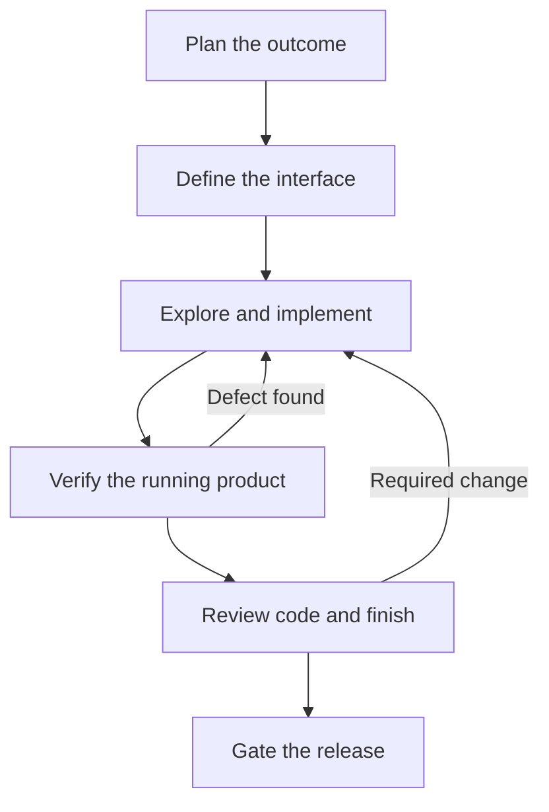

# Production Pit Crew

**For Codex today. Portable core by design.**

Production Pit Crew is an evidence-driven workflow pack for planning, designing, verifying, reviewing, and shipping production-quality software. The first supported adapter targets Codex and provides four focused custom agents plus four reusable skills.

The skills contain the reusable workflow logic and follow the open Agent Skills structure. Codex-specific TOML agents and installation paths live alongside that portable core. Future host adapters are in scope, but only the Codex edition is supported and tested in v0.1.

This is an independent, curated derivative inspired by [Agency Agents](https://github.com/msitarzewski/agency-agents). It is not affiliated with or endorsed by that project. See [Third-party notices](THIRD_PARTY_NOTICES.md) for attribution and [Honourable mentions](docs/honourable-mentions.md) for the ideas retained or deliberately left out.

## What is included

| Type | Name | Purpose |
| --- | --- | --- |
| Skill | `pitcrew-plan-delivery` | Turn an idea or vague request into a repository-aware, verifiable delivery plan. |
| Skill | `pitcrew-design-interface` | Define a product-specific interface contract before material UI work. |
| Agent | `pitcrew_product_designer` | Produce that contract independently, without editing the implementation. |
| Skill | `pitcrew-verify-browser` | Verify real browser journeys, responsive behavior, keyboard use, and runtime evidence. |
| Agent | `pitcrew_browser_verifier` | Exercise the implemented product and retain scoped evidence without fixing code. |
| Agent | `pitcrew_ui_critic` | Judge finish, hierarchy, state quality, and product fit after verification. |
| Agent | `pitcrew_change_reviewer` | Review a diff for correctness, regressions, data safety, and missing tests. |
| Skill | `pitcrew-gate-release` | Make a fair `PASS`, `HOLD`, or `BLOCKED` release decision from current evidence. |

The pack stays intentionally small. Codex's built-in exploration and implementation capabilities remain the right tools for codebase mapping and code changes; the custom roles add independent specialist judgment around them.

## Distribution

The repository includes an official `.codex-plugin/plugin.json` manifest that packages the four skills for ChatGPT and Codex. Public plugin-directory submission is planned after local and release testing. The custom agent TOML files remain a Codex adapter and are installed separately by the safe filesystem installer.

## Install the Codex adapter

Requirements: Python 3.11 or newer, plus Bash on macOS/Linux or Windows PowerShell 5.1/PowerShell 7 on Windows.

Install into the current project:

```bash
./scripts/install.sh --scope project --project-dir .
```

Install into the current project on Windows:

```powershell
powershell -File .\scripts\install.ps1 -Scope Project -ProjectDir .
```

Install for the current user:

```bash
./scripts/install.sh --scope user
```

```powershell
powershell -File .\scripts\install.ps1 -Scope User
```

Use `--dry-run` (PowerShell: `-DryRun`) to inspect actions first. The installer validates the complete operation before writing, tracks only this pack's files, refuses unmanaged conflicts by default, and supports safe reinstallation and uninstall. See [Usage](docs/usage.md) for paths and all options.

Start a fresh Codex session after installation so the new agents and skills are discovered.

## Recommended workflow



Use only the stages the work needs. A small backend fix may need planning, implementation, focused review, and tests but no interface contract. A material UI build usually benefits from the full path.

Example prompt:

```text
Use pitcrew-plan-delivery to turn this request into a build-ready plan. Then use
pitcrew_product_designer for the interface contract. Implement the smallest complete
slice, ask pitcrew_browser_verifier to verify it independently, and use
pitcrew-gate-release for the final evidence decision.
```

Codex remains the orchestrator. The roles do not spawn one another, invent work, claim persistent memory, or approve a release without evidence.

## Design principles

- Product fit over fashionable defaults.
- Observable acceptance criteria over subjective scores.
- Real runtime evidence over confident prose.
- Independent verification over builder self-approval.
- A clean review is valid; findings are never manufactured to meet a quota.
- Missing evidence is reported as unverified or blocked, not converted into a pass or failure.
- Existing stacks, conventions, and user work are preserved unless the task requires change.

## Repository guide

- [`HANDOFF.md`](HANDOFF.md) records the latest verified project state, limitations, and next release step.
- [`.codex-plugin/`](.codex-plugin/) packages the portable skills as an OpenAI plugin.
- [`agents/`](agents/) contains Codex custom-agent TOML files.
- [`skills/`](skills/) contains portable workflow skills and their focused references.
- [`scripts/`](scripts/) contains the cross-platform installer and repository validator.
- [`tests/`](tests/) contains installer and validation tests.
- [`docs/project-brief.md`](docs/project-brief.md) records the product scope and success criteria.
- [`docs/roadmap.md`](docs/roadmap.md) records supported and planned adapters.
- [`docs/chatgpt-project-setup.md`](docs/chatgpt-project-setup.md) keeps the matching ChatGPT Project organised.
- [`docs/architecture.md`](docs/architecture.md) explains boundaries and control flow.
- [`docs/usage.md`](docs/usage.md) contains installation and prompt recipes.

## Validate locally

```bash
python3 scripts/validate.py --strict
python3 -m unittest discover -s tests -v
bash -n scripts/install.sh
```

PowerShell 5.1 and PowerShell 7 lifecycle behavior is exercised in CI on Windows. A release candidate is built only from a clean Git commit:

```bash
python3 scripts/build_release.py --output-dir dist --verify-extracted
```

## Contributing and security

Read [CONTRIBUTING.md](CONTRIBUTING.md) before changing pack behavior. Report security issues using the private process in [SECURITY.md](SECURITY.md).

## License

Production Pit Crew is available under the [MIT License](LICENSE). Upstream attribution is recorded in [THIRD_PARTY_NOTICES.md](THIRD_PARTY_NOTICES.md).
