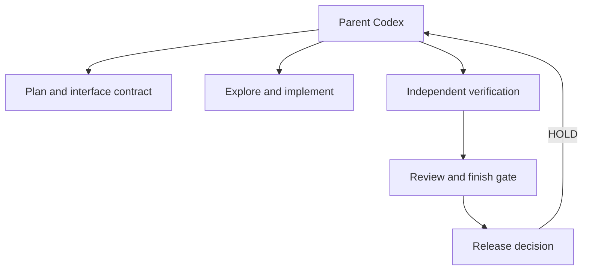

# Architecture

Production Pit Crew is a coordination layer, not an autonomous multi-agent runtime. In the current Codex adapter, a parent Codex session chooses the stages, supplies scope, delegates bounded specialist work, and owns implementation decisions.

## Components

| Layer | Responsibility | Writes product code? |
| --- | --- | --- |
| Parent Codex session | Understands the request, chooses the workflow, implements or delegates implementation, resolves findings | Yes, when authorized |
| Planning skill | Converts requirements and repository evidence into delivery slices and acceptance criteria | No |
| Product designer | Defines the product-specific interface contract | No |
| Browser verifier | Exercises the running product and records scoped evidence | Evidence only |
| UI critic | Makes a cold finish assessment against the brief and observed implementation | No |
| Change reviewer | Reviews the diff and affected behavior for concrete risks | No |
| Release-gate skill | Maps current requirements to evidence and returns `PASS`, `HOLD`, or `BLOCKED` | No |

Codex's built-in exploration and implementation capabilities fill the middle of the workflow. This avoids duplicating generic worker roles and keeps the custom pack focused on places where an independent contract or judgment changes the result.

## Control flow

The parent passes an authoritative brief, acceptance criteria, candidate identity, and available environment to each stage. Specialists return artifacts or findings; they do not call one another. A `HOLD` returns concrete defects and re-verification conditions to the parent. `BLOCKED` means the decision lacks required access or evidence, not that the product failed.

## Agent boundaries

### `pitcrew_product_designer`

Runs read-only before material interface implementation. It inspects real product language, components, content, and constraints, then returns an implementation-ready contract. It does not create a fashionable redesign by default.

### `pitcrew_browser_verifier`

Uses workspace write access only so it can retain new evidence under `.pitcrew/evidence`. It must record the working tree before verification, discover the project's own commands and routes, avoid product-code changes, and report unexpected mutations.

### `pitcrew_ui_critic`

Runs read-only after runtime evidence exists. It separates observed defects, requirement violations, usability hypotheses, and preferences. Missing decision-grade evidence yields `NOT VERIFIED`; it does not become an invented defect.

### `pitcrew_change_reviewer`

Runs read-only against a focused diff and affected execution paths. It prioritizes correctness, regression, data-safety, permission, and test risks. Broad security assurance belongs to dedicated security tooling.

## Skill boundaries

Skills use progressive disclosure: each `SKILL.md` holds the core workflow and links to one focused reference for deeper checks. The main guidance stays usable without loading every checklist.

| Skill | Primary artifact |
| --- | --- |
| `pitcrew-plan-delivery` | Delivery plan with acceptance evidence and risks |
| `pitcrew-design-interface` | Interface contract and state matrix |
| `pitcrew-verify-browser` | Browser verification report and retained runtime evidence |
| `pitcrew-gate-release` | Requirement matrix, decision, and shortest path to pass |

## Installation model

The installer reads `pitcrew-package.json` for source components and `ownership.json` for the exact-file ownership boundary, including explicit historical paths needed for safe upgrades.

The `.codex-plugin/plugin.json` manifest packages the standards-based skills for ChatGPT and Codex. Custom-agent TOML files are deliberately outside that portable skill layer.

| Scope | Agents | Skills |
| --- | --- | --- |
| Project | `<project>/.codex/agents` | `<project>/.agents/skills` |
| User | `${CODEX_HOME:-~/.codex}/agents` | `~/.agents/skills` |

Before mutation, the installer validates canonical source-to-target bindings, retained source bytes, target paths, collisions, platform restrictions, existing content, and prior ownership state. Exact matches are no-ops. Unmanaged conflicts stop the operation unless forced. Installer state records exact managed files and hashes, but state cannot authorize a destructive action unless its digest also appears in the trusted current or historical package inventory.

Dry runs create no files or directories. Mutating operations use a lock, atomic replacement, apply-time digest checks, conflict-preserving rollback, and exclusive no-clobber backups. POSIX installs reject unsafe shared or other-account-controlled destination ancestry to keep another local account from racing pathname checks. Windows mutation fails closed in v0.1 until a handle-relative, reparse-safe backend is available; validation and dry-run remain supported. Uninstall removes only exact managed files that still match recorded ownership. It leaves directories in place because file ownership does not prove the pack created a pre-existing empty directory; it never recursively deletes an installation root.

The legacy `.cwc` state directory and state filename remain stable so the renamed pack can verify and migrate untouched preview installations. New state records use the `production-pit-crew` identity. Legacy paths are accepted only when both their exact path and shipped historical SHA-256 are present in `ownership.json`.

## Portability boundary

The core skill instructions, references, report formats, and evidence semantics are host-neutral. Each adapter may translate discovery, delegation, sandbox, browser, and installation details, but it must not weaken the workflow's independence or evidence rules.

The Codex adapter is the only supported adapter in v0.1. Claude Code, Gemini CLI, and other Agent Skills-compatible hosts are future scope. An adapter is not considered supported until its native configuration, installation, representative workflows, and failure behavior are tested on that host.

## Trust and evidence model

The pack deliberately separates four kinds of claims:

1. **Requirement:** an authoritative outcome or constraint.
2. **Observation:** something actually seen in the candidate build, diff, log, trace, screenshot, or test.
3. **Inference:** a likely explanation that is labelled as such.
4. **Preference:** an optional idea that cannot block release by itself.

This keeps design feedback useful without turning taste into policy, and keeps release confidence proportional to the evidence actually obtained.
